<div align="center">



<br/>

[](https://portfolio-two-roan-71.vercel.app/en)
[](https://www.linkedin.com/in/ahmed-mohamed)
[](https://github.com/AhmedMohamed800)
[](mailto:ahmedmoh0107@gmail.com)

</div>

---

## 🛠️ Tech Stack

<div align="center">

<table>
  <tr>
    <td align="center" width="200"><strong>🎨 Languages</strong></td>
    <td>
      
      
      
      
      
    </td>
  </tr>
  <tr>
    <td align="center"><strong>⚛️ Frameworks</strong></td>
    <td>
      
      
      
      
      
    </td>
  </tr>
  <tr>
    <td align="center"><strong>🎨 Styling</strong></td>
    <td>
      
      
      
    </td>
  </tr>
  <tr>
    <td align="center"><strong>🗄️ Databases</strong></td>
    <td>
      
      
    </td>
  </tr>
  <tr>
    <td align="center"><strong>🔧 Tools & DevOps</strong></td>
    <td>
      
      
      
      
      
      
    </td>
  </tr>
</table>

</div>

---

## 💼 Experience

| Period | Role | Company | Location |
|--------|------|---------|----------|
| `10/2024 – 01/2025` | 🖥️ Front-End Developer *(Freelance)* | **Ultra Academy** | Iraq 🇮🇶 |
| `08/2024 – 09/2025` | 🦷 Front-End Developer *(Freelance)* | **Dentalist** | UAE 🇦🇪 |
| `07/2024 – 03/2025` | 🔧 Full Stack Developer *(Part-time)* | **AMACO Consulting** | Cairo 🇪🇬 |
| `03/2024 – 05/2024` | 📊 Front-End Developer *(Freelance)* | **Sky Limit** | USA 🇺🇸 |

### 🔍 Highlights

- 🏗️ Built a **custom CMS** with Go (Echo) + Vue.js + HTMX + MySQL, deployed via Docker & Caprover
- 📚 Developed an **LMS platform** with Next.js + React, integrated with a Django back-end
- 🦷 Designed & built the **Dentalist** e-commerce platform (dental B2B) using Vue.js + Figma
- 📞 Integrated **VoIP (Voximplant SDK)** and **crypto payments (BitPay)** into a CRM frontend

---

## 🚀 Featured Project

### [API Empire](https://github.com/AhmedMohamed800/API-Empire)
> A subscription-based API marketplace for developers — think RapidAPI, built from scratch.

- **Stack:** React.js · Flask (Python) · MySQL
- **Features:** PayPal subscription integration · API key management · Developer dashboard

```
 ┌──────────────┐     ┌──────────────┐     ┌──────────────┐
 │   React.js   │────▶│    Flask    │────▶│    MySQL     │
 │   Frontend   │     │   REST API   │     │   Database   │
 └──────────────┘     └──────────────┘     └──────────────┘
         │                                        │
         └──────────── PayPal Subscriptions ──────┘
```

---

## 🎓 Education & Certifications

- 🎓 **B.A. Italian Language & Literature** — Ain Shams University *(2020 – 2024)*
- 💻 **Software Engineering Program** — ALX Africa × Holberton School *(2023 – 2024)*
- 🌍 **Training of Trainers (TOT)** — Sustainable Development Ambassador

---

## 🌟 Strengths

```
💬 Communication     ──────────────────── Excellent
🤝 Collaboration     ──────────────────── Team-first mindset
🔍 Attention to Detail ──────────────── Pixel-perfect delivery
🧩 Problem Solving   ──────────────────── Analytical & creative
🌐 Cultural Awareness ─────────────────── 3 languages spoken
```

---

<div align="center">

### 📬 Let's Build Something Great Together

[](mailto:ahmedmoh0107@gmail.com)
[](tel:+201126799609)

---

*"Clean code. Responsive interfaces. Delivered on time."* 🚀


</div>
